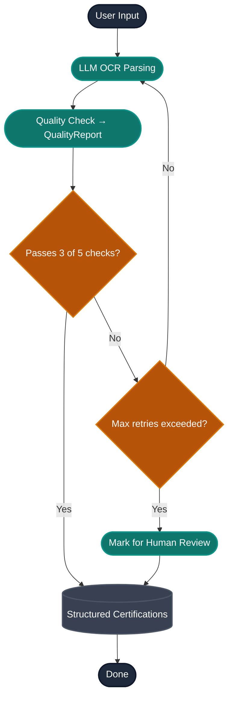

# Agentic Workflow Ideas

## Employee Certification Agent

### Employee Flow

Employees interact with the system by uploading a credential document. An LLM
extracts the certification into a typed structure, a validator scores the
extraction, and only extractions that clear the quality gate are persisted.

**Extraction → structured output.** The OCR step returns a typed
`Certification` (cert type from a known enum, issuing body, issue/expiry dates,
employee identifiers) rather than free text. That schema is both what we store
and what the quality check scores.

**Quality check → `QualityReport`.** A validator produces a structured report of
5 checks and the gate passes when **at least 3 of 5** pass. The checks are a
hybrid so the score is meaningful:

| # | Check | Kind |
|---|---|---|
| 1 | Cert type resolves to a known taxonomy entry | deterministic |
| 2 | Expiry date parses and is within a sane range | deterministic |
| 3 | Issuing body is present / recognized | deterministic |
| 4 | Employee name present and matches the uploader | LLM-judged |
| 5 | Document is legible / all required fields were found | LLM-judged |

**Retry is targeted.** On a failing report, the *failed* checks are fed back
into the extraction prompt so the next pass corrects specific fields rather than
re-rolling blindly. After `max_retries`, the record is routed to human review.

**Persistence is gated.** The structured certification is written to the
database **only** after it clears the gate (on the `Yes` path) or after a human
resolves it — never straight off the raw OCR output.

 - Database indexed by hospital, cert type, and expiration date
 - Employee PII (name, identifiers) is stored by design — this is workforce
   credentialing data, not patient PHI

## Manager Flow

Managers can then directly talk to an agent to find different employees based on certifications and needs