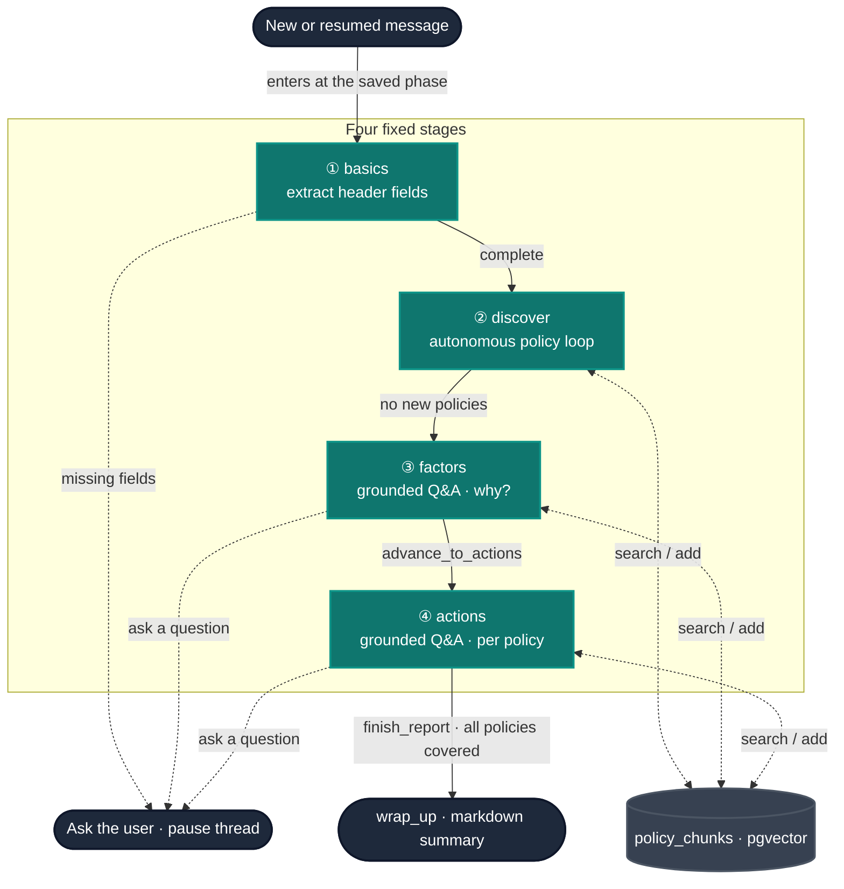

# Incident Reporting Agent

A conversational agent that walks a practitioner through filing a clinical
incident report, grounded in the facility's **own policies** (retrieved with
RAG). It gathers the basics, autonomously discovers every relevant policy, then
works through the contributing factors and the policy-required actions — recording
each with a citation to the exact policy text that grounds it.

## Architecture at a glance

- **Policy corpus → RAG.** Policy PDFs are ingested (PDF → markdown + metadata via
  one LLM call → markdown-aware chunks → embeddings) into a `policy_chunks` table
  in Postgres/pgvector. `PolicyService` does the vector retrieval. See the
  ingestion pipeline in `CareAI/ingestion/` and the store in `CareAI/database/`.
- **Agent.** A semi-structured LangGraph with four fixed stages; the reasoning
  *within* each stage is the LLM's (`CareAI/agents/reporting/`).
- **API.** FastAPI: a reporting router (chat + SSE stream + state) and a policies
  router (upload + list), behind a shared `X-API-Key` and CORS
  (`CareAI/api/`).
- **UI.** A thin Streamlit client that streams the agent over SSE and renders the
  report-so-far (`CareAI/ui/`).

## Design principle

The LLM drives the conversation and the reasoning within each stage. The
**structure** (the stages) and the **safety-critical checks** (grounding and
completeness) are deterministic code, not prompt promises:

- **Grounding is enforced in code.** Every citation must name a policy that was
  actually added to the grounding set *and* a chunk index that exists in it.
  `_validate_links` rejects anything else and enriches valid citations with the
  chunk's text, so each stored item carries its exact grounding for review.
- **Completeness is a deterministic gate.** Intake can only finish once **every
  added policy has at least one assessed action** (`finish_report` checks
  `covered_policy_ids`). The agent's own policy selection defines "done"; the code
  enforces it. This recovers a deterministic completeness signal without a
  per-incident-type schema.
- **Actions carry a disposition.** Each policy-required action is classified
  `done_correctly` / `omission` / `commission` (the omission/commission framing
  from clinical root-cause analysis). Omissions and commissions *are* the
  procedure gaps a reviewer and the manager view care about.

We deliberately did **not** build a per-incident-type field/severity config —
policies are the single source of truth, and duplicating them into hand-authored
config invites drift. Parsing a deterministic schema *out of* the policies offline
remains a future consideration (`future-considerations.md`).

## The four stages

The stage is tracked in `ReportingState.phase`, so a new user message resumes the
right stage and a tool loop returns to the stage it came from.

1. **basics** — `extract_basics` pulls the header fields out of the conversation
   (incident type, when, where, a one-line summary, people involved).
   `ask_basics` asks for whatever is still missing in **one combined question**.
   These basics are a fixed, universal set — every report has them — not a
   per-type schema.
2. **discover** — an **autonomous, reasoned policy loop** with no practitioner
   involvement. It searches the policy library, adds every relevant policy, and
   follows the threads *between* policies (a needlestick → sharps handling →
   bloodborne-pathogen exposure → employee-health timelines) until further
   searches surface nothing new. Capped at N rounds so it can't run away.
3. **factors** — a grounded Q&A loop: *why* did it happen? Confounding/
   contributing factors are recorded (optionally cited to a policy chunk when the
   factor is a deviation from a standard). It may re-search and add policies if a
   new facet appears, and ends by calling `advance_to_actions`.
4. **actions** — a grounded Q&A loop, policy by policy: what action each policy
   required and whether it was done, recorded with a **disposition** and a chunk
   citation. `finish_report` gates on full policy coverage; then `wrap_up` emits a
   deterministic markdown summary.

## Grounding model (the heart of it)

- `search_policies(query)` → candidate **chunks**, each labelled with its
  `policy_id` and `chunk_index`.
- `add_policy(policy_id)` → adds that policy (and all its chunks) to the grounding
  set. Only added policies may be cited.
- `record_action` / `record_contributing_factor` cite a `PolicyLink`
  (`policy_id` + `chunk` index + `reason`). The code checks the chunk exists in an
  added policy and attaches its text; invalid citations are rejected with the list
  of valid chunk indices.

## Tools

`search_policies`, `add_policy`, `search_incidents` (de-identified precedent,
currently a mock), `record_report_info`, `record_contributing_factor`,
`record_action`, `advance_to_actions`, `finish_report`. Each stage is bound only
the tools it should use; a shared `ToolNode` executes whichever was called.

## The report

`IncidentReport` = header (`incident_type`, `occurred_at`, `location`, `summary`,
`people`), `actions_taken` (each `{description, disposition, related_policies}`),
`contributing_factors`, and the grounding policies. `report_id` / `reporter_id` /
`reported_at` are system-set. (`status` / `severity` fields exist on the model but
are not yet populated by the agent — see *Planned*.)

## Flow

## API

All `/api/v1/*` routes require a valid `X-API-Key`; `/health` is unauthenticated.

| Method | Path | Purpose |
|---|---|---|
| POST | `/api/v1/reporting/threads/{id}/messages` | Send a message, get the full reply |
| POST | `/api/v1/reporting/threads/{id}/stream` | SSE: `token` / `tool` / `done` events |
| GET  | `/api/v1/reporting/threads/{id}` | The report collected so far |
| POST | `/api/v1/policies/upload` | Upload PDF(s); ingested concurrently |
| GET  | `/api/v1/policies` | List ingested policies |

The SSE stream emits incremental `token` text from the user-facing stages, plus
**human-readable `tool`** events ("Searching policies for '…'", "Adding policy
POL-EH-001") so the UI can show what the agent is doing — especially during the
otherwise-silent discovery stage.

## Built vs. planned

**Built:** policy ingestion + pgvector RAG; the four-stage agent; code-enforced
chunk grounding; action dispositions; the deterministic completeness gate; the
reporting + policies API with API-key auth, CORS, and SSE streaming; the Streamlit
UI.

**Planned / not yet built:**

- **Role-based access** (employee sees own reports; manager sees all, plus past
  incidents and procedure gaps) — enforced at the store layer, not the prompt.
- **Severity** assessment (grounded in policy) — currently unused; dispositions
  carry the compliance signal for now.
- **Review pass** — deterministic checks (Pydantic validity, every citation points
  at a real chunk — already enforced at record time) plus one LLM pass (narrative
  vs. recorded data, policy conflicts) that decides when a human must review.
- **Notifications & deadlines** extracted from the cited policy prose and drafted.
- **Audit logging** (append-only who/what/when, identifiers only — no PHI).
- **Past-incident RAG** — `search_incidents` is a mock today; the real
  de-identified corpus is a separate feature.

## Open questions

- **De-identification for the incidents corpus.** Deterministic PII stripping
  (regex/NER) vs. an LLM redaction pass, when past-incident RAG lands.
- **Do we need severity at all** given the omission/commission dispositions, or is
  severity better derived from the dispositions + policy deadlines?
- **Discovery cap tuning.** Is a fixed round cap right, or should discovery stop on
  a "no new policies" signal with the cap only as a backstop?
- **Abandoned / partial intake.** A thread can stop mid-flow; how does a partial
  report get surfaced for human follow-up?
- **Human review outcome.** Approve/reject only, or edit-and-re-check — and does an
  edit re-enter review?
